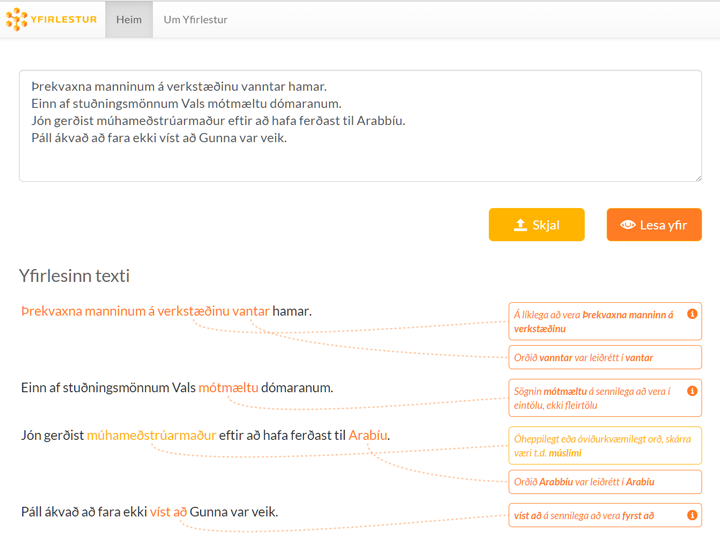

[](https://gitter.im/Greynir/Lobby?utm_source=badge&utm_medium=badge&utm_campaign=pr-badge&utm_content=badge)


# Yfirlestur

### Spelling and grammar correction for Icelandic

*Yfirlestur.is* is a public website where you can enter or submit your Icelandic text
and have it checked for spelling and grammar errors.

The tool also gives hints on words and structures that might not be appropriate,
depending on the intended audience for the text.

Try Yfirlestur (in Icelandic) at [https://yfirlestur.is](https://yfirlestur.is)!

<a href="https://raw.githubusercontent.com/mideind/Yfirlestur/master/static/img/yfirlestur-example.png?raw=true" title="Yfirlestur annotation">

</a>

*Text with annotations, as displayed by Yfirlestur.is*

The core spelling and grammar checking functionality of Yfirlestur.is is provided by the
[GreynirCorrect](https://github.com/mideind/GreynirCorrect) engine, by the same authors.

## HTTPS API

In addition to its graphical web front-end, Yfirlestur.is exposes a public
HTTPS/JSON application programming interface (API) to perform spelling and grammar
checking.

This API can for example by accessed by `curl` as follows:

```bash
    $ curl https://yfirlestur.is/correct.api -d "text=Manninum á verkstæðinu vantar hamar"
```

...or, of course, via a HTTPS `POST` from your own code - see below.

All text is assumed to be coded in UTF-8.

The example returns the following JSON (shown indented, for ease of reading):

```json
{
  "result": [
    [
      {
        "annotations": [
          {
            "code":"P_WRONG_CASE_þgf_þf",
            "detail":"Sögnin 'að vanta' er ópersónuleg. Frumlag hennar á að vera í þolfalli í stað þágufalls.",
            "end":2,
            "start":0,
            "suggest":"Manninn á verkstæðinu",
            "text":"Á líklega að vera 'Manninn á verkstæðinu'"
          }
        ],
        "corrected":"Manninum á verkstæðinu vantar hamar",
        "tokens": [
          {"k":6,"x":"Manninum"},
          {"k":6,"x":"á"},
          {"k":6,"x":"verkstæðinu"},
          {"k":6,"x":"vantar"},
          {"k":6,"x":"hamar"}
        ]
      }
    ]
  ],
  "stats":
    {
      "ambiguity":1.0,
      "num_parsed":1,
      "num_sentences":1,
      "num_tokens":5
    },
  "text":"Manninum á verkstæðinu vantar hamar",
  "valid":true
}
```

The `result` field contains the result of the annotation, as a list of paragraphs,
each containing a list of sentences, each containing a list of annotations (under
the `annotations` field). Of course, if a sentence is correct and has no annotations,
its annotation list will be empty.

Each sentence has a field containing a `corrected` version of it, where all
likely errors have been corrected, as well as a list of `tokens`. The tokens
originate in the [Tokenizer package](https://github.com/mideind/Tokenizer)
and their format is documented there.

Each annotation applies to a span of sentence tokens, starting with the index
given in `start` and ending with the index in `end`. Both indices are 0-based
and inclusive. An annotation has a `code` which uniquely determines the type
of error or warning. If the code ends with `/w`, it is a warning, otherwise
it is an error.

An annotation has a short, human-readable `text` field which describes
the annotation succintly, as well as a `detail` field which has further detail
on the annotation, possibly containing grammatical explanations.

Finally, some annotations contain a `suggest` field with text that could
replace the text within the token span, if the user agrees with
the suggestion being made.

The result JSON further includes a `stats` field with information about
the annotation job, such as the number of tokens and sentences processed,
and how many of those sentences could be parsed. The `valid` field is
`true` if the request was correctly formatted and could be processed
without error, or `false` if there was a problem.

As an example of accessing the Yfirlestur API from Python, here is
a short demo program which submits two paragraphs of text to the
spelling and grammar checker:

```python
import requests
import json

# The text to check, two paragraphs of two and one sentences, respectively
my_text = (
    "Manninum á verkstæðinu vanntar hamar. Guðjón setti kókið í kælir.\n"
    "Mér dreimdi stórann brauðhleyf."
)

# Make the POST request, submitting the text
rq = requests.post("https://yfirlestur.is/correct.api", data=dict(text=my_text))

# Retrieve the JSON response
resp = rq.json()

# Enumerate through the returned paragraphs, sentences and annotations
for ix, pg in enumerate(resp["result"]):
    print(f"\n{ix+1}. málsgrein")
    for sent in pg:
        print(f"   {sent['corrected']}")
        for ann in sent["annotations"]:
            print(
                f"      {ann['start']:03} {ann['end']:03} "
                f"{ann['code']:20} {ann['text']}"
            )
```

This program prints the following output:

```bash
$ python test.py

1. málsgrein
   Manninum á verkstæðinu vantar hamar.
      000 002 P_WRONG_CASE_þgf_þf  Á líklega að vera 'Manninn á verkstæðinu'
      003 003 S004                 Orðið 'vanntar' var leiðrétt í 'vantar'
   Guðjón setti kókið í kælir.
      004 004 P_NT_EndingIR        Á sennilega að vera 'kæli'

2. málsgrein
   Mér dreymdi stóran brauðhleif.
      000 000 P_WRONG_CASE_þgf_þf  Á líklega að vera 'Mig'
      001 001 S004                 Orðið 'dreimdi' var leiðrétt í 'dreymdi'
      002 002 S001                 Orðið 'stórann' var leiðrétt í 'stóran'
      003 003 S004                 Orðið 'brauðhleyf' var leiðrétt í 'brauðhleif'
```

The open source *GreynirCorrect* engine that powers Yfirlestur.is
is further [documented here](https://yfirlestur.is/doc/).

## Copyright and licensing

Yfirlestur is copyright © 2020 [Miðeind ehf.](https://mideind.is)
The original author of this software is *Vilhjálmur Þorsteinsson*.


This set of programs is free software: you can redistribute it and/or modify it
under the terms of the GNU General Public License as published by the Free
Software Foundation, either version 3 of the License, or (at your option) any later
version.

This set of programs is distributed in the hope that it will be useful, but WITHOUT
ANY WARRANTY; without even the implied warranty of MERCHANTABILITY or FITNESS FOR
A PARTICULAR PURPOSE. See the GNU General Public License for more details.

The full text of the GNU General Public License v3 is
[included here](https://github.com/mideind/Yfirlestur/blob/master/LICENSE)
and also available here: [https://www.gnu.org/licenses/gpl-3.0.html](https://www.gnu.org/licenses/gpl-3.0.html).

If you wish to use this set of programs in ways that are not covered under the
GNU GPLv3 license, please contact us at [mideind@mideind.is](mailto:mideind@mideind.is)
to negotiate a custom license. This applies for instance if you want to include or use
this software, in part or in full, in other software that is not licensed under
GNU GPLv3 or other compatible licenses.
